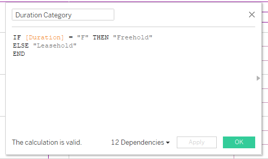
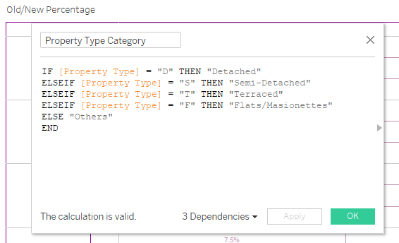
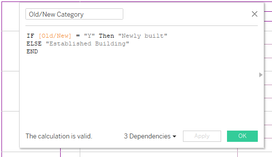
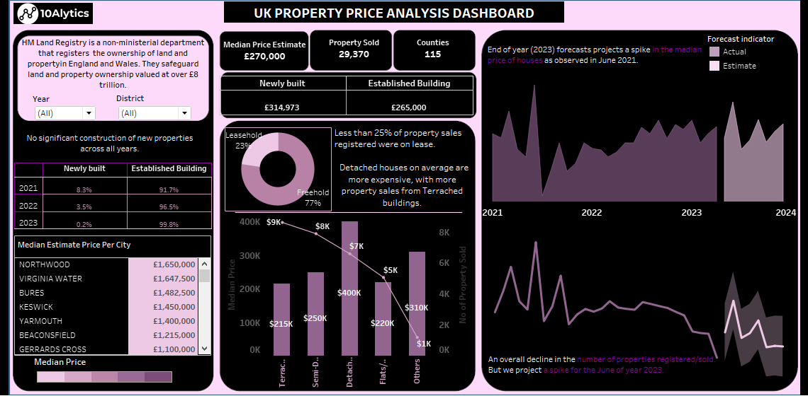

# UK-Property-Sales-Analysis
This is a Property Sales Analysis done using Tableau.

## Introduction:

I decided to advance my career as a data analyst by acquiring knowledge and abilities in predictive, prescriptive, and cognitive analytics, in addition to descriptive and diagnostic analytics.  So to get help improving my talents, I signed up for 10alytics. One of the case studies I worked on was this one.

It is for HM Land Registry, a property registry firm that records and protects the ownership of nearly £8 trillion worth of land and property in England and Wales. Therefore, HM Land Registry's services are used by anyone purchasing, selling, or even taking out a mortgage on land or property. They provided thorough data on real estate transactions in Wales and England between the years 2021, 2022 and first four months of 2023. 

## Problem Statement:

In order to maximize their operations, the analysis's objective is:
- To gain insights and spot patterns and trends present in the data. 
- To forecast prices and sales for the upcoming year
- Lastly, to design a dashboard that would communicate information and the year-end projection.

## Skills and Concepts demonstrated:
- Tableau is the tool used.
- Other skills demonstrated included creating calculated fields.
- Forecasting on Tableau
- Data analysis and visualization using Tableau

## Data Source:
It was a data sheet provided by the organization as a csv file. Comprising of 29370 rows and 12 columns.

## Data Cleaning / Transformation:

Data Dictionary was provided  by the organization and it made me know that several transformation or formatting needs to be done to enable me understand the data.
Hence, several queries or statements were written to eliminate ambiguity. The queries were simple “IF statements” and “ELSE IF Statements”.
You can find them below:

## Data Analysis and Visualization:

I wanted to create a dashboard with floating abilities, that will enable me align my KPIs very well. I ended up creating 11 views and a dashboard.
Here is the dashboard.

You can view and interact with it on my Tableau Profile [here:](https://public.tableau.com/app/profile/amarachi.nwoke.ugagbe/viz/UKPropertyAnalysis_17119836336030/Dashboard1)

To add an extra layer of spice to my dashboard, I designed the background image on PowerPoint and inserted into Tableau. I had a mental knowledge of how the dashboard will come out so it was easier to create the background image for the dashboard. 
Here is the background template designed in Microsoft PowerPoint.

## Analysis:

- I used the Median for Median Price estimation across the cities instead of just the sum as Median will give me a better representation of the prices of apartment across the cities.
- 115 counties were represented
- The median Price of Houses is estimated to be £270,000. They sold a total of 29,370 properties in all the period of which 51% was sold in 2021, then 43% was sold in 2022 leaving 6% sales for the first four months of 2023.
- He Median Price slightly increased across the year form £269,313 in 2021 to £270,000 in 2022 and to £275,000 in 2023.
- There were no significant construction of new properties across all years. 
- Less than 25% of property sales registered were on lease.
- Detached houses on average are more expensive followed by other house types.
- However, more property sales came from Terrached buildings and semi-detached buildings
- June 2023 forecasts projects a spike in the median price of houses which was also observed in June 2021.
- An overall decline in the number of properties registered/sold. But we project a spike for the June of year 2023, just as there was a spike for number of property sold/ registered in June 2021.

## Recommendation:
There has to be something going on in the month of June. A further indepth analysis should be done with more information around the month of June.

Thank you for reading.

